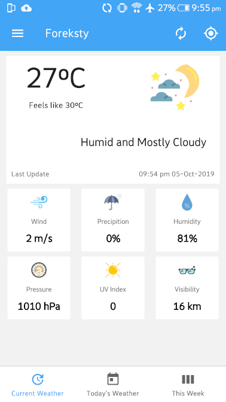
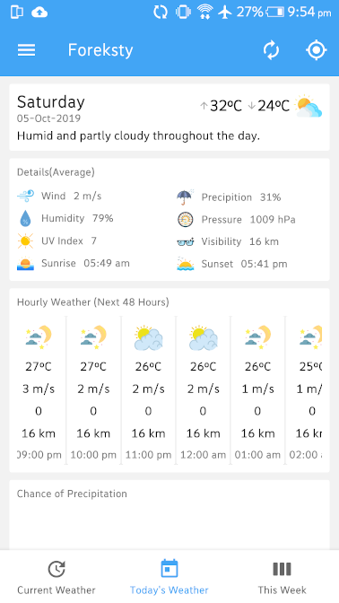
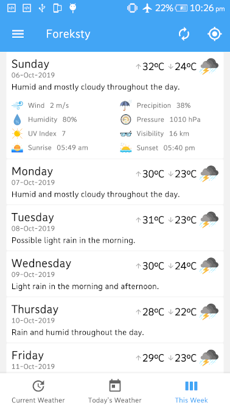
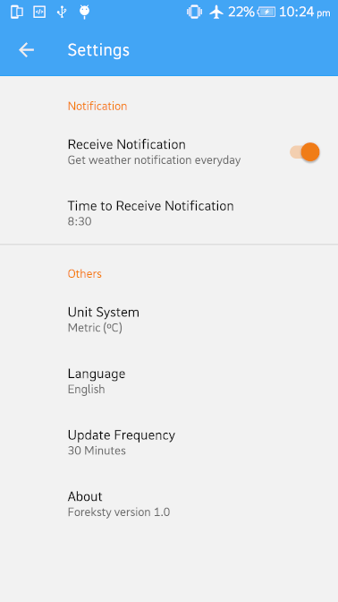

# Foreksty


Foreksty is a simple and nice looking android application that provide weather information. It can provide currently, daily and weekly weather update. User can set notification time for getting weather update via notificaiton.
<br><br>Foreksty use Darksky API for weather data source. It is developed by using kotlin and android architecture components like LiveData, ViewModel, Room, Navigation. Following google's MVVM(Model View ViewModel) architecture which enhances separation of concerns. For injecting
dependencies use Kodein, caching data using Room Persistence library and async task manages using kotlin coroutines.

[Try Sample APK](https://drive.google.com/open?id=1wAa_12UOrHE3rzFsMYcoUk87LMDlV7Pd)


### Sample

Current Weather | Today's Weather
-------------|-----------------
 |  

Week Weather | Settings
-------------|-----------------
 | 


### Features:

* Choose weather location or get weather for current location.
* Currently, Daily, Weekly weather information.
* Weather update notification. 
* Offline caching, user can view previous fetch data without internet connection.
* Two unit systems for weather information.
* Support multiple language.


### Used libraries:

* [Constraint Layout](https://developer.android.com/training/constraint-layout)
* [Card View](https://developer.android.com/guide/topics/ui/layout/cardview)
* [Recycler View](https://developer.android.com/guide/topics/ui/layout/recyclerview)
* [Navigation Component](https://developer.android.com/guide/navigation/navigation-getting-started)
* [Room Persistence Library](https://developer.android.com/topic/libraries/architecture/room)
* [Retrofit](http://square.github.io/retrofit/)
* [Preference](https://developer.android.com/reference/android/preference/Preference)
* [Kodein-DI](https://github.com/Kodein-Framework/Kodein-DI)


### Developed by:

	Md. Imam Hossain Johny  email: ihjony23@gmail.com


### License

```
Copyright 2019 Imam Hossain

Licensed under the Apache License, Version 2.0 (the "License");
you may not use this file except in compliance with the License.
You may obtain a copy of the License at

   http://www.apache.org/licenses/LICENSE-2.0

Unless required by applicable law or agreed to in writing, software
distributed under the License is distributed on an "AS IS" BASIS,
WITHOUT WARRANTIES OR CONDITIONS OF ANY KIND, either express or implied.
See the License for the specific language governing permissions and
limitations under the License.